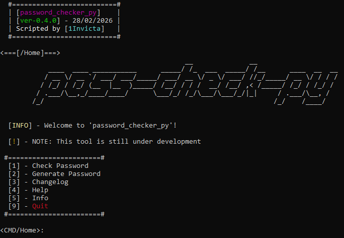
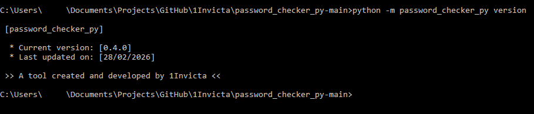
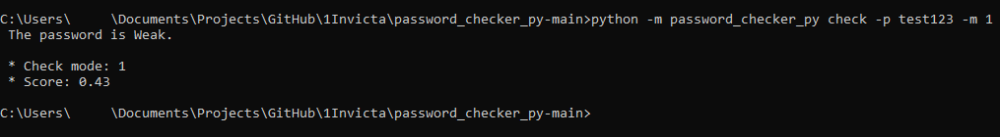
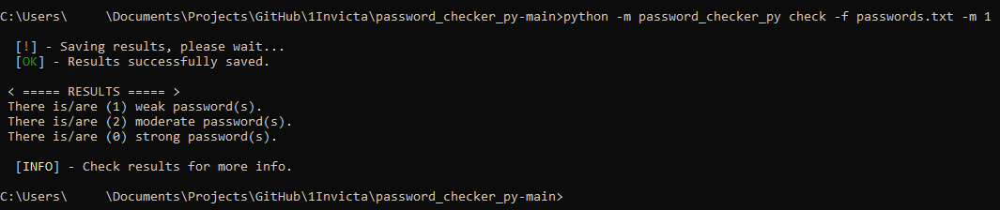
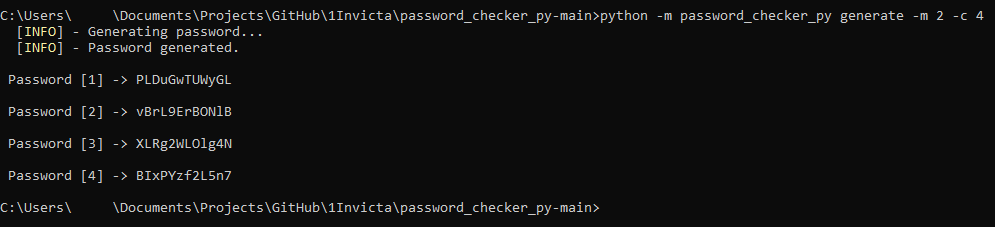
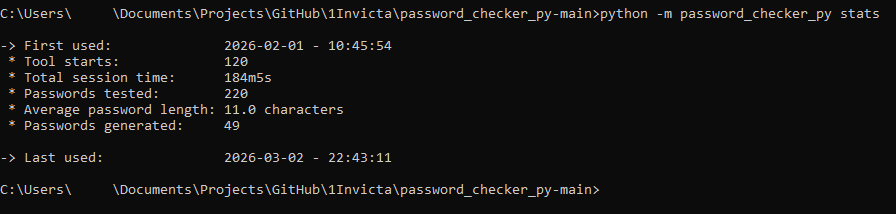

# Password Checker (Python)

A simple password-checking tool written in Python.
It evaluates password strength based on length and the presence of uppercase letters, lowercase letters, digits and special characters among others.

<br>

## Features

- Checks for minimum password length
- Detects:
  - Uppercase letters
  - Lowercase letters
  - Digits
  - Special characters
  - Patterns
  - Entropy
- Feedback describing why a password passes or fails
- Statistics support (via 'stats')
- Logging support (via '--log')

<br>

## Installation

Clone the repository:
```bash
$ git clone https://github.com/1Invicta/password_checker_py.git
$ cd password_checker_py
```

<br>

## Usage

#### Default

Run the password checker with CLI user interface:
```bash
$ python -m password_checker_py run
```

<br><br>

#### Command-Line arguments

Check version:
```bash
$ python -m password_checker_py version
```

<br><br>

Check a password:
```bash
$ python -m password_checker_py check -p [password] -m [1-3]
```

<br><br>

Check passwords from a file:
```bash
# Don't forget the extension! Supports .txt and .json formats
$ python -m password_checker_py check -f [filename/path] -m [1-3]
```

<br><br>

Generate a password, or many:
```bash
# Defaults to a single password
$ python -m password_checker_py generate -m [1-3]

# Generate multiple passwords using '-c'
$ python -m password_checker_py generate -m [1-3] -c 4
```

<br><br>

Output results (in JSON format):
```bash
# Generated password results are automatically saved if there are more than 5!
$ python -m password_checker_py check -p [password] -m [1-3] -o [filename]
```

Check your usage statistics:
```bash
$ python -m password_checker_py check stats
```

<br><br>

## Planned improvements

This is an evolving project. Upcoming updates may include:
* More rigorous password rules
* Improved CLI experience
* Possibly ports to C and/or C++ later on

<br>

## About the project

I like to prototype tools in Python before moving to lower-level languages.
This project is part of my goal to build a larger "developer toolkit" over time. <br>
Eventually, Python will serve as a simple interface used for easy tool deployment, and lower-level languages will consolidate performance.

<br>

## License

This project is licensed under the Apache 2.0. <br>
See the LICENSE file for details.
